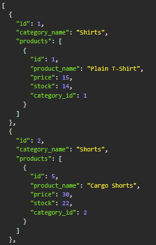
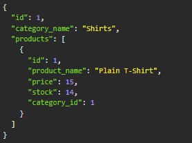
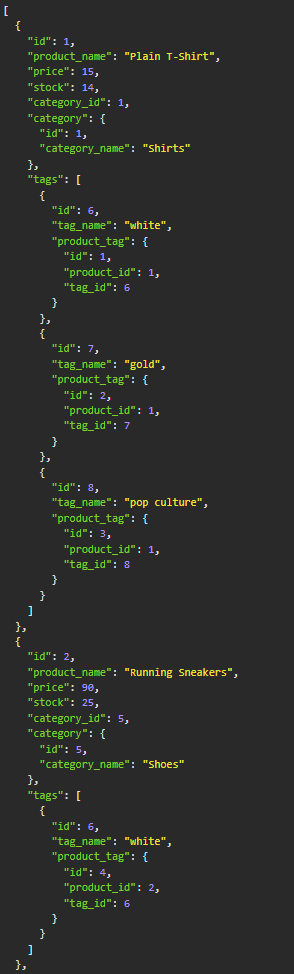
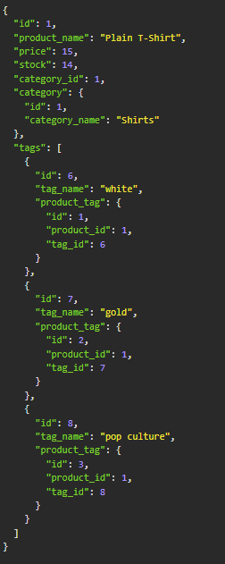
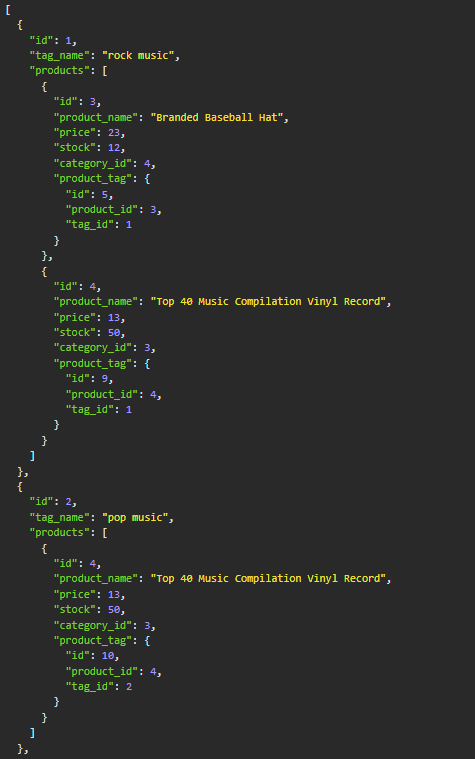
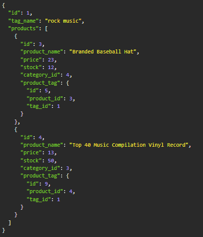

<base target="_blank">

# e-Commerce API

<a href="#description">Description</a> •
<a href="#key-features">Key Features</a> •
<a href="#usage">Usage</a> •
<a href="#technologies-used">Technologies Used</a> •
<a href="#concepts-demonstrated">Concepts Demonstrated</a> •
<a href="#author">Author</a>

-------------------------------------------------------

[Video Demo on YouTube](#TODO)

-------------------------------------------------------

## About the e-Commerce API


## Category API

### Get All Categories

GET ```/categories```

Example response:                        


### Get Category By ID

GET ```/categories/{id}```

Example response:                           


### Create a Category


### Update a Category


### Delete a Category


## Product API

### Get All Products

GET ```/products```

Example response:                        


### Get Product By ID

GET ```/products/{id}```

Example response:                        


### Create a Product


### Update a Product


### Delete a Product


## Tag API

### Get all Tags

GET ```/tags```

Example response:                        


### Get Tag By ID

GET ```/tags/{id}```

Example response:                        


### Create a Tag


### Update a Tag


### Delete a Tag


## Key Features


## Technologies Used

- [Sequelize](https://sequelize.org/)
- [mysql2](https://www.npmjs.com/package/mysql2)
- [Express.js](https://expressjs.com/)
- [dotenv Package](https://www.npmjs.com/package/dotenv)
- [node.js](https://nodejs.org/en/)
- [JavaScript](https://www.javascript.com/)

## Concepts Demonstrated

- The use of node.js
- Installing and using node.js packages using npm.
- General JavaScript and programming knowledge.

## Author

Adam Ferro
- [Github](https://github.com/GeminiAd)
- [Linked-In](https://www.linkedin.com/in/adam-ferro)